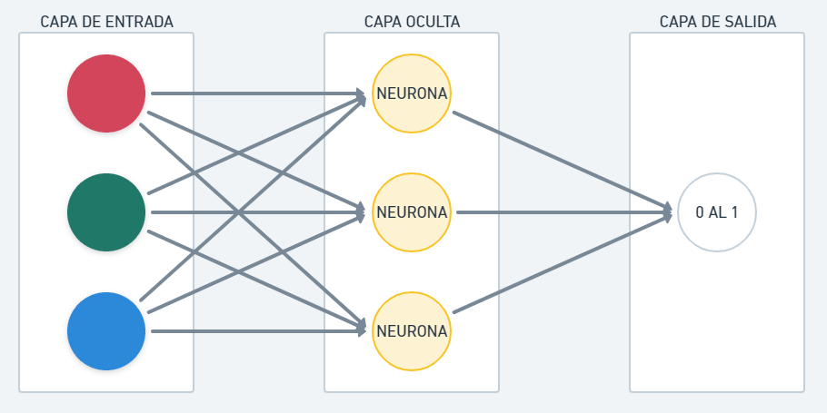

# Predicción de color
Red neuronal que determina el color que debe tener un texto dependiendo del color del fondo, para que pueda ser legible.

## Capas en una red neuronal
La capa oculta es dónde se ubica la red neuronal.

## Dependencias
 